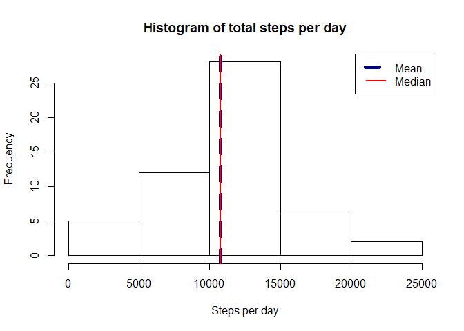
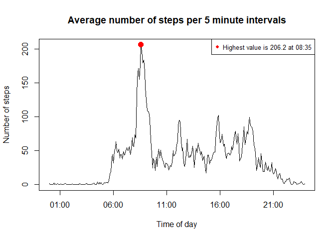
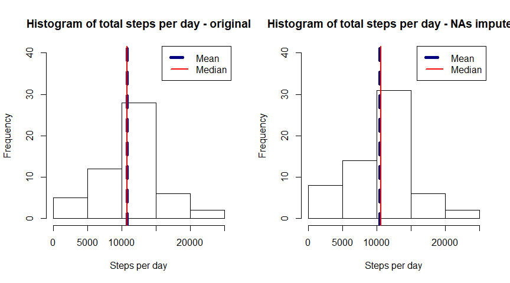
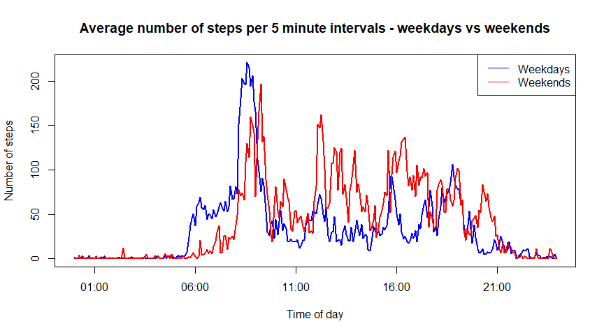

## Preparatory work

First we will do some work to prepare the R environment.

Let's load the MICE package (also switch off output messages as these are not relevant).

```r
library(mice)
```

## Loading and preprocessing the data

Let's start by loading the data into R, change the date column to date format and check the contents.


```r
tracker.data <- read.csv("activity/activity.csv",
                         colClasses = c("integer", "character", "integer"))
tracker.data$date <- as.Date(tracker.data$date, "%Y-%m-%d")
interval.hour <- lapply(tracker.data$interval, function(x) {trunc(x/100)})
interval.min <- lapply(tracker.data$interval,
                       function(x) { round(x/100 - floor(x/100),2)*100 } )
tracker.data$interval <- as.POSIXct(paste(as.character(interval.hour),
                              as.character(interval.min), sep=":"), format="%H:%M")
str(tracker.data)
```

```
## 'data.frame':	17568 obs. of  3 variables:
##  $ steps   : int  NA NA NA NA NA NA NA NA NA NA ...
##  $ date    : Date, format: "2012-10-01" "2012-10-01" ...
##  $ interval: POSIXct, format: "2019-03-29 00:00:00" "2019-03-29 00:05:00" ...
```

OK, looks good! I think we can move to the next step.

## What is mean total number of steps taken per day?

Right, so first we calculate the sum of steps taken on each day, mean and median values.


```r
tracker.by.date <- sapply(split(tracker.data$steps, tracker.data$date), sum)
tracker.mean <- mean(tracker.by.date, na.rm = TRUE)
tracker.median <- median(tracker.by.date, na.rm = TRUE)
```

And now the output of these values as well as the histogram plotting them.


```r
paste("Mean:", tracker.mean, " Median:", tracker.median)
```

```
## [1] "Mean: 10766.1886792453  Median: 10765"
```

```r
hist(tracker.by.date, main="Histogram of total steps per day", xlab="Steps per day")
abline(v = tracker.mean, col = "navy", lwd=5, lty=2)
abline(v = tracker.median, col = "red", lwd=2)
legend("topright", c("Mean","Median"), col=c("navy","red"), lwd=c(5,2), lty=c(2,1))
```

<!-- -->

Not the work of art but shows the information!

## What is the average daily activity pattern?

Now let's move to time series chart. First we will need to calculate the average steps per 5-minute break. By the way, we take `mean` as representation of average steps.


```r
tracker.by.minute <- sapply(split(tracker.data$steps, tracker.data$interval),
                            mean, na.rm=TRUE)
```

This will show the pattern of 5-minute breaks with steps taken in each of them and highlight the daily peak of steps across the measured timeframe.


```r
plot(as.POSIXct(names(tracker.by.minute)), tracker.by.minute, type="l",
     main="Average number of steps per 5 minute intervals",
     xlab="Time of day", ylab="Number of steps")
points(as.POSIXct(names(which.max(tracker.by.minute))), max(tracker.by.minute),
       pch=19, cex=1.5, col="red")
legend("topright", paste("Highest value is", round(max(tracker.by.minute),1), "at", 
                         strftime(names(which.max(tracker.by.minute)), "%H:%M")), 
       cex=0.8, col="red", pch=19)
```

<!-- -->

## Imputing missing values

OK, now let's get cracking with NA's. First let's have a look at how many NA's we got in `steps` columns.


```r
paste("Total NA values:", sum(is.na(tracker.data$steps)))
```

```
## [1] "Total NA values: 2304"
```

```r
paste("Proportion of NA values:", round(mean(is.na(tracker.data$steps)),2)*100, "%")
```

```
## [1] "Proportion of NA values: 13 %"
```

2.3k missing values or 13%.. That is quite a lot and likely to impact our calculations!

MICE package can be used to impute those NA values in relatively simple but clever way.

We will use classification and regression trees to derive the imputed values. At this point I am not entirely sure whether that is appropriate for this example but it does seem to be more sophisticated than plain mean values.


```r
imputed.temp <- mice(tracker.data, meth="cart", seed=123)
imputed.data <- complete(imputed.temp, 1)
```


```r
paste("Total NA values:", sum(is.na(imputed.data$steps)))
```

```
## [1] "Total NA values: 0"
```

Looks good - no more NA values!

We will now recalculate the sums of steps per day, mean and median values and have a new histogram.


```r
imputed.by.date <- sapply(split(imputed.data$steps, imputed.data$date), sum)
imputed.mean <- mean(imputed.by.date, na.rm = TRUE)
imputed.median <- median(imputed.by.date, na.rm = TRUE)
paste("Mean:", imputed.mean, " Median:", imputed.median)
```

```
## [1] "Mean: 10428.393442623  Median: 10600"
```

```r
par(mfrow=c(1,2))
hist(tracker.by.date, ylim=c(0,40), main="Histogram of total steps per day - original",
     xlab="Steps per day")
abline(v = tracker.mean, col = "navy", lwd=5, lty=2)
abline(v = tracker.median, col = "red", lwd=2)
legend("topright", c("Mean","Median"), col=c("navy","red"), lwd=c(5,2), lty=c(2,1))
hist(imputed.by.date, ylim=c(0,40), main="Histogram of total steps per day - NAs imputed",
     xlab="Steps per day")
abline(v = imputed.mean, col = "navy", lwd=5, lty=2)
abline(v = imputed.median, col = "red", lwd=2)
legend("topright", c("Mean","Median"), col=c("navy","red"), lwd=c(5,2), lty=c(2,1))
```

<!-- -->

The shape of histogram has not changed significantly but the mean and median values has reduced somewhat. It is also interesting that the mean and median is further from each other than they were in original scenario.

## Are there differences in activity patterns between weekdays and weekends?

OK, and the final part. We start by creating a new factor variable for Weekday/Weekend.


```r
imputed.data$daytype <- as.factor(ifelse(format(imputed.data$date,"%u")<=5, "Weekday", "Weekend"))
str(imputed.data)
```

```
## 'data.frame':	17568 obs. of  4 variables:
##  $ steps   : num  0 0 6 0 0 0 0 0 0 0 ...
##  $ date    : Date, format: "2012-10-01" "2012-10-01" ...
##  $ interval: POSIXct, format: "2019-03-29 00:00:00" "2019-03-29 00:05:00" ...
##  $ daytype : Factor w/ 2 levels "Weekday","Weekend": 1 1 1 1 1 1 1 1 1 1 ...
```

Looking good! Let's now calculate the mean for each combination of day type and interval. And then let's construct a time series graph comparing the weekdays and weekends activities.


```r
imputed.by.weekday <- aggregate(imputed.data$steps,
                by=list(imputed.data$daytype, imputed.data$interval), FUN=mean)
names(imputed.by.weekday) <- c("daytype", "interval", "steps")
plot(imputed.by.weekday$interval, imputed.by.weekday$steps, type="n",
     main="Average number of steps per 5 minute intervals - weekdays vs weekends",
     xlab="Time of day", ylab="Number of steps")
with(subset(imputed.by.weekday, daytype=="Weekday"),
     lines(interval, steps, col="blue", lwd=2))
with(subset(imputed.by.weekday, daytype=="Weekend"),
     lines(interval, steps, col="red", lwd=2))
legend("topright", c("Weekdays","Weekends"), col=c("blue","red"), lwd=c(1,1), lty=c(1,1))
```

<!-- -->
